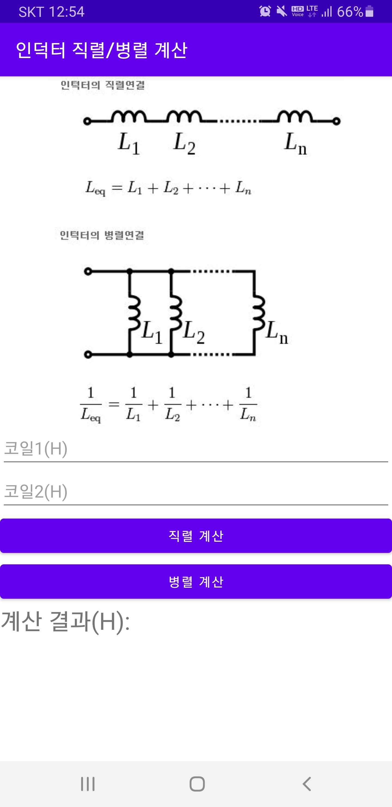
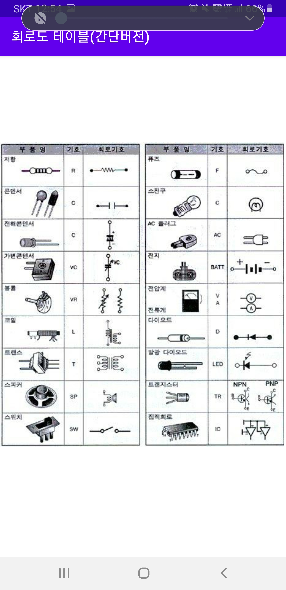
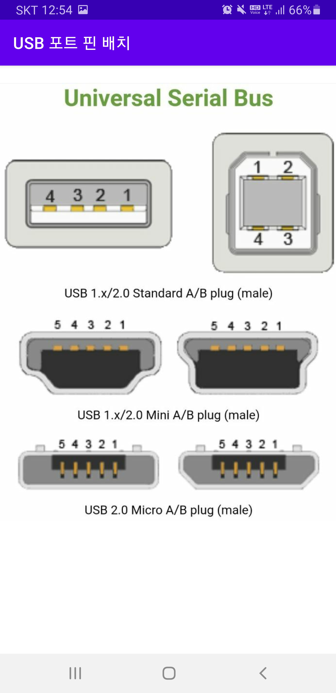
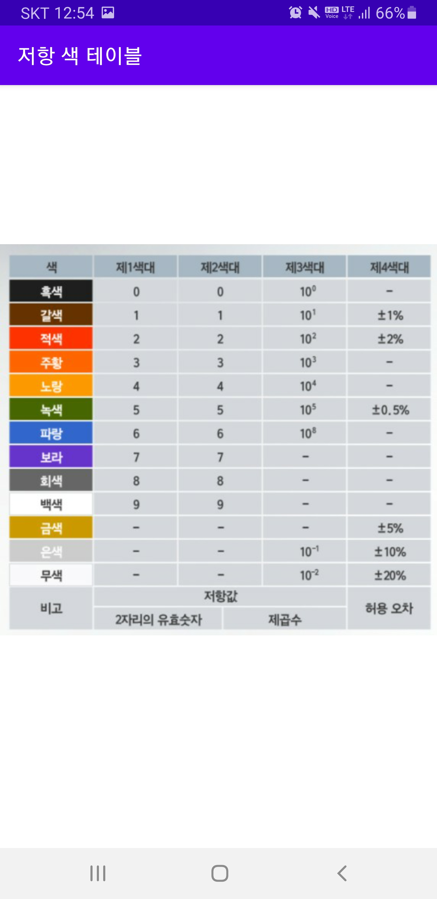
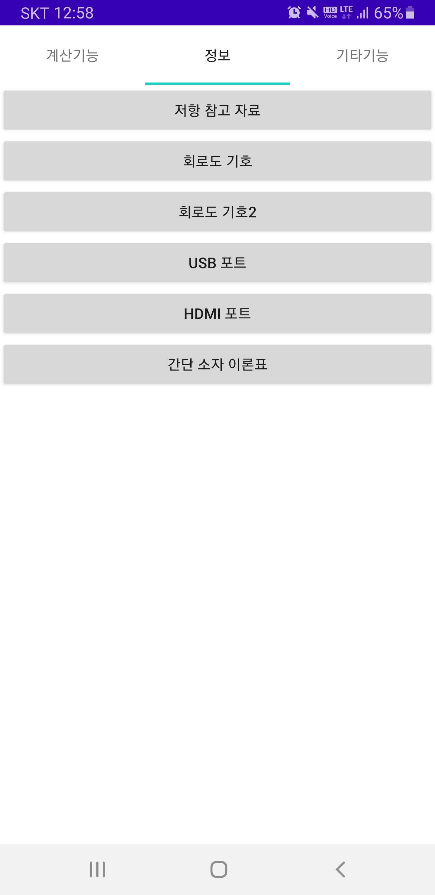
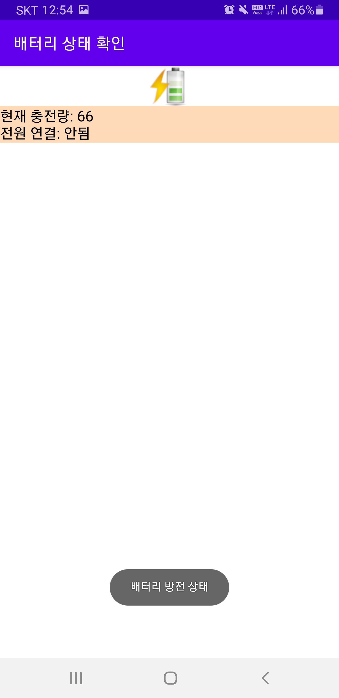

# 공학툴 1.0 (Engineering Tool 1.0)

전자공학 전공자를 위한 계산 도우미 Android 애플리케이션입니다.  
직렬/병렬 회로 계산, 연산 증폭기 구성 등 전자 회로 기초에 필요한 주요 계산을 제공합니다.

---

## 📱 주요 기능

- **저항 계산기**  
  - 직렬 / 병렬 연결된 저항의 합성 저항 계산

- **커패시터 계산기**  
  - 직렬 / 병렬 연결된 커패시터의 합성 정전 용량 계산

- **인덕터 계산기**  
  - 직렬 / 병렬 연결된 인덕터의 합성 인덕턴스 계산

- **연산 증폭기 계산기**  
  - 기본적인 연산 증폭기 회로 계산

- **정보 제공**
  - 저항 소자 및 회로 기호, USB/HDMI 포트 정보 제공

- **기타 기능**
  - 배터리 확인 / 음악 / 구글 검색 / 정보통신기술사이트
---

## 🛠️ 개발 환경

- **개발 도구**: Android Studio
- **언어**: Kotlin
- **Minimum SDK**: 28 (Android 9.0)
- **Target SDK**: 30
- **Gradle Plugin**: 4.x (업데이트 필요 시 7.x로 변경 권장)

---

## 🚀 실행 방법

1. Android Studio에서 `공학툴1.0` 프로젝트 디렉토리를 엽니다.
2. Gradle Sync를 완료합니다.
3. USB 디버깅이 허용된 Android 디바이스 또는 에뮬레이터를 실행합니다.
4. ▶ 버튼 또는 `Shift + F10`으로 앱을 실행합니다.

---

## 📂 디렉토리 구조

```
공학툴1.0/
├── app/
│   ├── src/
│   │   └── main/
│   │       ├── java/com/sonbyungha/engineertool/  # 액티비티 클래스
│   │       ├── res/                                # 레이아웃 및 리소스
│   │       └── AndroidManifest.xml
├── build.gradle
├── settings.gradle
└── ...
```

---

## 📌 참고 및 개선사항

- 본 프로젝트는 Android Studio 기준으로 오래된 환경에서 제작되었으며, **Gradle 버전 및 SDK 업데이트**가 필요할 수 있습니다.
- 향후 다음 기능 추가를 고려할 수 있습니다:
  - 오프라인 저장 기능
  - 사용자 입력 기록 저장 및 복원
  - UI/UX 개선

---

## 👤 개발자

- 손병하 (Byungha Son)  
- 전자공학 기반 실용 도구 설계에 관심이 있으며, Kotlin 및 Android 개발 경험 보유


---

## 🖼️ 사용 예시 화면

아래는 공학툴 1.0 앱의 실제 화면 예시입니다.

### 🔹 저항 / 커패시터 / 인덕터 계산기

- 직렬/병렬 계산이 가능한 전자 부품 계산기 기능

| 저항 계산기 | 커패시터 계산기 | 인덕터 계산기 |
|-------------|----------------|---------------|
|  |  |  |

---

### 🔹 연산 증폭기 계산기

- 연산 증폭기 기본 회로의 증폭률 계산 지원

| 연산 증폭기 |
|-------------|
|  |

---

### 🔹 전자 기호 및 정보 제공

- 저항 색 코드표, 포트 정보 등 정보 제공

| 저항 색 코드표 | USB 정보 | HDMI 정보 |
|----------------|----------|------------|
|  |  |  |

---

### 🔹 기타 기능

- 배터리 확인 및 기본 검색 도구

| 배터리 상태 확인 |
|------------------|
|  |


